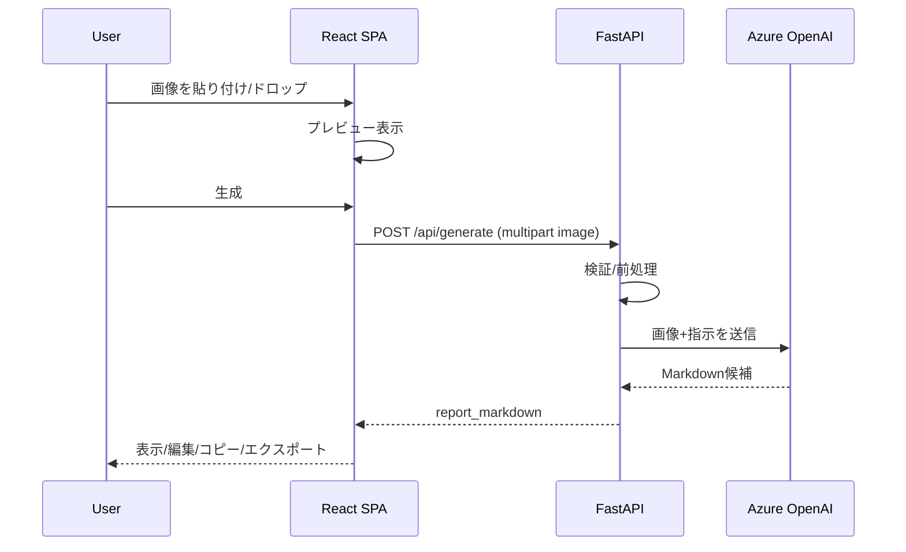

# 日報アプリMVP 技術設計

## 1. アーキテクチャ概要
- フロントエンド: React（SPA）
- バックエンド: FastAPI（Web API）
- 生成: Azure OpenAI GPT-4.1（マルチモーダル）
- データ保持: データベースなし（必要最小限のサーバメモリ一時保持）

## 2. コンポーネント構成
### 2.1 フロントエンド
- 画像入力
  - ドラッグ&ドロップ
  - クリップボード貼り付け
  - ファイル選択
- 画像プレビュー
- 生成ボタン
- ローディング表示
- エラー表示
- Markdown表示/編集（textareaベース）
- コピー（Clipboard API）
- エクスポート（ブラウザダウンロード）

#### フロント実装（MVP）補足
- 開発サーバ: Vite（`http://localhost:3000` 固定）
- バックエンドURL: `VITE_API_BASE_URL`（未指定時は `http://localhost:8000`）
- 入力制約（任意・フロント側の早期バリデーション）
  - `VITE_MAX_IMAGE_BYTES`（未指定時: 5MB）
  - `VITE_REQUEST_TIMEOUT_MS`（未指定時: 60000ms）

### 2.2 バックエンド
- `/healthz`（ヘルスチェック）
- `/api/generate`（画像→Markdown生成）
- Azure OpenAI 呼び出しモジュール
- 画像前処理モジュール（必要最小限）
- 一時メモリ保持（TTL）モジュール（MVPでは最小利用）

## 3. データフロー
1) フロントで画像を受理しプレビュー
2) ユーザーが生成を実行
3) フロント → バックへ multipart/form-data で画像送信
4) バックで検証（形式/サイズ/デコード）
5) 必要に応じて前処理（リサイズ/圧縮）
6) Azure OpenAIへ画像＋指示（テンプレ）を送信
7) 返ってきた内容を「3セクションMarkdown」に整形
8) フロントへ返却して編集/コピー/エクスポート

## 4. API設計

### 4.1 `GET /healthz`
- 目的: 稼働確認
- レスポンス: `200 OK`（固定文字列またはJSON）

### 4.2 `POST /api/generate`
- Content-Type: `multipart/form-data`
- リクエスト
  - `image`: 画像ファイル（必須）

- レスポンス（成功）: `200 OK`
  - JSON
    - `report_markdown`: string（生成されたMarkdown）
    - `model`: string（利用モデル名）
    - `processing_ms`: number（処理時間・任意）

- レスポンス（失敗）
  - `400 Bad Request`: 入力不正（非画像、サイズ超過、破損など）
  - `413 Payload Too Large`: サイズ超過（採用する場合）
  - `429 Too Many Requests`: レート制限（将来/必要時）
  - `500 Internal Server Error`: 想定外
  - `502/503`: Azure側の障害相当（内部表現は統一）

- エラーJSON（例）
  - `code`: string（例: `INVALID_IMAGE`, `MODEL_ERROR`, `TIMEOUT`）
  - `message`: string（ユーザー向け要約）
  - `detail`: string（開発者向け詳細、MVPでは省略可）

## 5. 生成プロンプト設計（方針）
- 出力はMarkdownのみ
- 必ず以下の見出しを含める
  - `## 作業内容`
  - `## 進捗状況`
  - `## 課題・問題点`
- 画像に情報がない場合は「不明」「読み取れず」等で埋め、捏造しない指示を含める

## 6. 画像前処理（方針）
- 目的: レスポンス時間とコスト最適化、送信サイズ削減
- MVP: 最小限の前処理のみ
  - 画像をデコードできるか確認
  - 画像の最大辺を上限に収める（例: 1024〜2048、値は設定化）
  - 必要に応じてJPEG化/圧縮（品質は設定化）

## 7. 一時メモリ保持（セッション）
- DBは使わない
- MVPでの利用方針
  - 画像は保持しない
  - 生成結果（Markdown）を保持するかはTBD（保持する場合はTTL付き）
  - サーバ再起動/スケールアウトで消える前提

## 8. 設定（環境変数）
- Azure OpenAI
  - `AZURE_OPENAI_ENDPOINT`
  - `AZURE_OPENAI_API_KEY`
  - `AZURE_OPENAI_DEPLOYMENT`
  - `AZURE_OPENAI_API_VERSION`
- アプリ
  - `CORS_ALLOW_ORIGINS`（例: `http://localhost:3000`）
  - `MAX_IMAGE_BYTES`
  - `REQUEST_TIMEOUT_SECONDS`
  - `IMAGE_MAX_SIDE_PX`

### 8.x .env（開発用）
- バックエンドは `backend/.env` を読み込める（環境変数も併用可）
- `.env` はリポジトリにコミットしない（`.env.example` を配布）

### 8.1 デフォルト値（MVP実装用）
- `CORS_ALLOW_ORIGINS`: `http://localhost:3000`
- `MAX_IMAGE_BYTES`: `5242880`（5MB）
- `REQUEST_TIMEOUT_SECONDS`: `60`
- `IMAGE_MAX_SIDE_PX`: `1536`

### 8.2 対応画像形式（MVPデフォルト）
- `image/png`, `image/jpeg`, `image/webp`

## 9. エラー行列
| 事象 | 検知箇所 | 応答 | フロント表示 | 備考 |
|---|---|---|---|---|
| 非画像 | バック（検証） | 400 | 入力エラー | 受理しない |
| サイズ超過 | フロント/バック | 413 or 400 | 入力エラー | 上限は要件で確定 |
| 画像破損 | バック（デコード） | 400 | 入力エラー | |
| Azure失敗 | バック（呼び出し） | 503/500 | 再試行促し | リトライはMVP最小 |
| タイムアウト | バック/フロント | 504相当 | 再試行促し | |

## 10. シーケンス（生成）

## 11. テスト方針（MVP）
- バック
  - 画像検証の単体テスト（非画像、破損、サイズ超過）
  - 整形（3見出し強制）の単体テスト
- フロント
  - 主要状態遷移（未選択→選択→生成中→成功/失敗）のテスト（可能なら）

## 12. 未確定（TBD）
- azure.instructions.md（ワークスペース外）の運用ルール取り込み
- App Service デプロイ方式とログ/監視
- 一時メモリ保持の対象（Markdownのみか、保持しないか）

## 13. 実装時の注意（暫定）
- Azure運用ルール文書がリポジトリ外にある場合、開発環境から参照できないことがある
  - その場合でも、APIキーや画像生データをログ出力しないこと、環境変数で設定可能であることを最低限担保する
