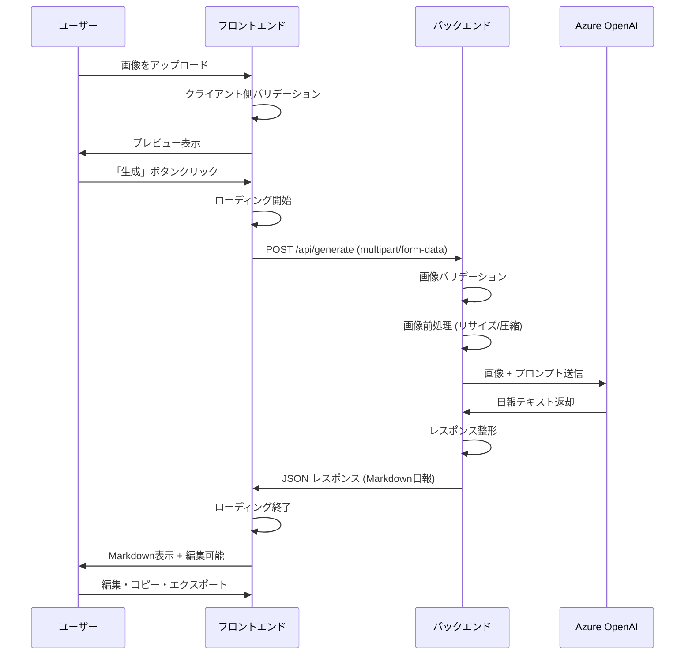
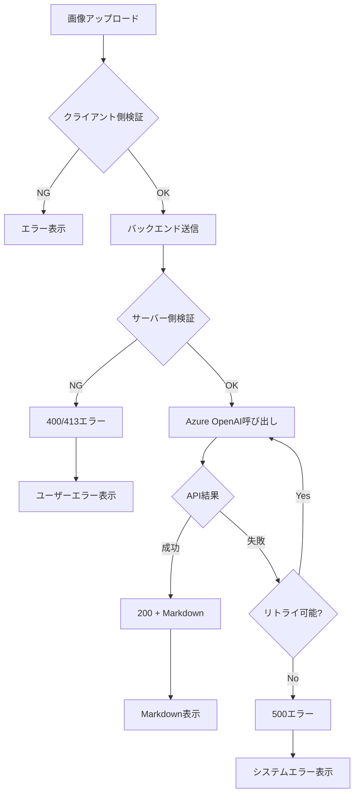

# 設計書（Design）

## 1. システムアーキテクチャ

### 1.1 全体構成図

```
┌─────────────────────────────────────────────────────────────┐
│                         ユーザー                              │
└────────────────────┬────────────────────────────────────────┘
                     │ HTTPS
                     ▼
┌─────────────────────────────────────────────────────────────┐
│                  フロントエンド (React + Vite)                │
│  ┌──────────────────────────────────────────────────────┐   │
│  │ ・画像アップロード (D&D, 貼り付け, ファイル選択)        │   │
│  │ ・プレビュー表示                                      │   │
│  │ ・生成ボタン + ローディング表示                       │   │
│  │ ・Markdown表示・編集                                  │   │
│  │ ・コピー・エクスポート機能                            │   │
│  └──────────────────────────────────────────────────────┘   │
└────────────────────┬────────────────────────────────────────┘
                     │ HTTP (開発: localhost, 本番: HTTPS)
                     │ POST /api/generate
                     ▼
┌─────────────────────────────────────────────────────────────┐
│                 バックエンド (FastAPI)                        │
│  ┌──────────────────────────────────────────────────────┐   │
│  │ GET /healthz - ヘルスチェック                         │   │
│  │ POST /api/generate - 日報生成                         │   │
│  │   ├─ 画像バリデーション                              │   │
│  │   ├─ 画像前処理 (リサイズ/圧縮)                      │   │
│  │   ├─ Azure OpenAI 呼び出し                           │   │
│  │   └─ レスポンス整形                                  │   │
│  └──────────────────────────────────────────────────────┘   │
└────────────────────┬────────────────────────────────────────┘
                     │ HTTPS
                     │ Azure OpenAI API
                     ▼
┌─────────────────────────────────────────────────────────────┐
│              Azure OpenAI Service (GPT-4.1)                  │
│  ・マルチモーダル画像解析                                     │
│  ・日報テキスト生成                                          │
└─────────────────────────────────────────────────────────────┘
```

### 1.2 コンポーネント構成

#### フロントエンド
```
frontend/
├── public/              # 静的ファイル
├── src/
│   ├── App.tsx         # メインアプリケーション
│   ├── components/     # UIコンポーネント
│   │   ├── ImageUploader.tsx      # 画像アップロード
│   │   ├── ImagePreview.tsx       # 画像プレビュー
│   │   ├── GenerateButton.tsx     # 生成ボタン
│   │   ├── LoadingSpinner.tsx     # ローディング表示
│   │   ├── MarkdownEditor.tsx     # Markdown編集
│   │   ├── ErrorMessage.tsx       # エラー表示
│   │   └── ActionButtons.tsx      # コピー・エクスポートボタン
│   ├── services/       # API連携
│   │   └── api.ts                 # バックエンドAPI呼び出し
│   ├── types/          # TypeScript型定義
│   │   └── index.ts
│   ├── utils/          # ユーティリティ
│   │   ├── fileValidation.ts      # ファイル検証
│   │   └── exportMarkdown.ts      # エクスポート処理
│   ├── main.tsx        # エントリーポイント
│   └── index.css       # グローバルスタイル
├── package.json
├── vite.config.ts
└── tsconfig.json
```

#### バックエンド
```
backend/
├── app/
│   ├── main.py                    # FastAPIアプリケーション
│   ├── api/
│   │   ├── __init__.py
│   │   ├── health.py              # ヘルスチェック
│   │   └── generate.py            # 日報生成エンドポイント
│   ├── services/
│   │   ├── __init__.py
│   │   ├── image_processor.py     # 画像検証・前処理
│   │   └── openai_service.py      # Azure OpenAI連携
│   ├── models/
│   │   ├── __init__.py
│   │   └── schemas.py             # Pydanticモデル
│   └── utils/
│       ├── __init__.py
│       ├── config.py               # 設定管理
│       └── logger.py               # ログ設定
├── requirements.txt
└── .env.example
```

## 2. データフロー

### 2.1 日報生成シーケンス図



### 2.2 エラーハンドリングフロー



## 3. API仕様

### 3.1 GET /healthz

**概要:** ヘルスチェックエンドポイント

**リクエスト:**
```
GET /healthz
```

**レスポンス（成功）:**
```json
{
  "status": "ok"
}
```

**ステータスコード:**
- 200: 正常

### 3.2 POST /api/generate

**概要:** 画像から日報を生成

**リクエスト:**
```
POST /api/generate
Content-Type: multipart/form-data

--boundary
Content-Disposition: form-data; name="image"; filename="screenshot.png"
Content-Type: image/png

[画像バイナリデータ]
--boundary--
```

**リクエストパラメータ:**
| パラメータ | 型 | 必須 | 説明 |
|-----------|-----|------|------|
| image | File | ✓ | 画像ファイル（PNG/JPEG/WEBP） |

**レスポンス（成功）:**
```json
{
  "markdown": "## 作業内容\n...\n\n## 進捗状況\n...\n\n## 課題・問題点\n..."
}
```

**レスポンス（エラー）:**
```json
{
  "detail": "エラーメッセージ"
}
```

**ステータスコード:**
- 200: 成功
- 400: バリデーションエラー（不正な画像形式など）
- 413: ファイルサイズ超過
- 500: サーバー内部エラー（Azure OpenAI呼び出し失敗など）
- 504: タイムアウト

## 4. データモデル

### 4.1 フロントエンド型定義

```typescript
// 画像状態
interface ImageState {
  file: File | null;
  preview: string | null;
  isValid: boolean;
  error: string | null;
}

// 生成状態
interface GenerationState {
  isLoading: boolean;
  markdown: string | null;
  error: string | null;
}

// APIレスポンス
interface GenerateResponse {
  markdown: string;
}

// APIエラーレスポンス
interface ErrorResponse {
  detail: string;
}
```

### 4.2 バックエンド Pydantic モデル

```python
from pydantic import BaseModel

class HealthResponse(BaseModel):
    status: str

class GenerateResponse(BaseModel):
    markdown: str

class ErrorResponse(BaseModel):
    detail: str
```

## 5. 実装詳細

### 5.1 画像バリデーション

**クライアント側（フロントエンド）:**
- ファイル拡張子チェック（.png, .jpg, .jpeg, .webp）
- ファイルサイズチェック（最大10MB）
- MIMEタイプチェック

**サーバー側（バックエンド）:**
- Content-Typeヘッダー検証
- ファイルサイズ検証（最大10MB）
- 画像ファイルとして読み込み可能か検証（Pillowで開く）

### 5.2 画像前処理

```python
from PIL import Image
import io

def preprocess_image(image_bytes: bytes) -> bytes:
    """
    画像をリサイズ・圧縮
    - 最大解像度: 2048x2048
    - JPEG圧縮: 品質85%
    """
    img = Image.open(io.BytesIO(image_bytes))
    
    # リサイズ
    max_size = 2048
    if img.width > max_size or img.height > max_size:
        img.thumbnail((max_size, max_size), Image.LANCZOS)
    
    # RGB変換（PNGのアルファチャンネル対応）
    if img.mode in ('RGBA', 'LA', 'P'):
        background = Image.new('RGB', img.size, (255, 255, 255))
        if img.mode == 'P':
            img = img.convert('RGBA')
        background.paste(img, mask=img.split()[-1] if img.mode == 'RGBA' else None)
        img = background
    
    # JPEG圧縮
    output = io.BytesIO()
    img.save(output, format='JPEG', quality=85, optimize=True)
    return output.getvalue()
```

### 5.3 Azure OpenAI 連携

```python
import openai
import base64
import os

def generate_daily_report(image_bytes: bytes) -> str:
    """
    Azure OpenAI GPT-4.1 で日報生成
    """
    # 画像をBase64エンコード
    base64_image = base64.b64encode(image_bytes).decode('utf-8')
    
    # Azure OpenAI 設定
    openai.api_type = "azure"
    openai.api_base = os.getenv("AZURE_OPENAI_ENDPOINT")
    openai.api_key = os.getenv("AZURE_OPENAI_API_KEY")
    openai.api_version = "2024-02-15-preview"
    
    # プロンプト
    system_prompt = """あなたは日報作成アシスタントです。
提供されたスクリーンショット画像から、以下の3セクション構成のMarkdown日報を生成してください。

## 作業内容
[画像から読み取れる具体的な作業内容を記述]

## 進捗状況
[作業の進捗状況を記述]

## 課題・問題点
[画像から読み取れる課題や問題点があれば記述、なければ「特になし」]
"""
    
    user_prompt = "このスクリーンショットから日報を生成してください。"
    
    # API呼び出し
    response = openai.ChatCompletion.create(
        engine=os.getenv("AZURE_OPENAI_DEPLOYMENT_NAME"),
        messages=[
            {"role": "system", "content": system_prompt},
            {
                "role": "user",
                "content": [
                    {"type": "text", "text": user_prompt},
                    {
                        "type": "image_url",
                        "image_url": {
                            "url": f"data:image/jpeg;base64,{base64_image}"
                        }
                    }
                ]
            }
        ],
        max_tokens=1000,
        temperature=0.7
    )
    
    return response.choices[0].message.content
```

### 5.4 エラーハンドリング実装

**リトライロジック:**
```python
import time
from functools import wraps

def retry_with_backoff(max_retries=3, base_delay=1):
    def decorator(func):
        @wraps(func)
        def wrapper(*args, **kwargs):
            for attempt in range(max_retries):
                try:
                    return func(*args, **kwargs)
                except Exception as e:
                    if attempt == max_retries - 1:
                        raise
                    delay = base_delay * (2 ** attempt)
                    time.sleep(delay)
            return None
        return wrapper
    return decorator

@retry_with_backoff(max_retries=3, base_delay=1)
def call_openai_with_retry(image_bytes: bytes) -> str:
    return generate_daily_report(image_bytes)
```

## 6. セキュリティ設計

### 6.1 環境変数管理

**必須環境変数:**
```
AZURE_OPENAI_ENDPOINT=https://your-resource.openai.azure.com/
AZURE_OPENAI_API_KEY=your-api-key
AZURE_OPENAI_DEPLOYMENT_NAME=gpt-4-vision
```

**任意環境変数:**
```
CORS_ORIGINS=http://localhost:3000
LOG_LEVEL=INFO
MAX_IMAGE_SIZE=10485760
```

### 6.2 ログ設定

**ログ出力内容:**
- リクエストID、タイムスタンプ
- エンドポイント、HTTPメソッド
- エラー詳細（スタックトレースは開発環境のみ）

**ログ出力禁止:**
- Azure OpenAI APIキー
- 画像データの詳細（バイナリデータ）
- ユーザーの個人情報（将来的に追加される場合）

### 6.3 CORS設定

**開発環境:**
```python
from fastapi.middleware.cors import CORSMiddleware

app.add_middleware(
    CORSMiddleware,
    allow_origins=["http://localhost:3000"],
    allow_credentials=True,
    allow_methods=["*"],
    allow_headers=["*"],
)
```

**本番環境:**
```python
app.add_middleware(
    CORSMiddleware,
    allow_origins=[os.getenv("FRONTEND_URL")],
    allow_credentials=True,
    allow_methods=["POST", "GET"],
    allow_headers=["Content-Type"],
)
```

## 7. デプロイ構成

### 7.1 開発環境
- フロントエンド: Vite Dev Server (localhost:3000)
- バックエンド: Uvicorn (localhost:8000)

**起動コマンド:**
```bash
# フロントエンド
cd frontend && npm run dev

# バックエンド
cd backend && uvicorn app.main:app --reload --port 8000
```

### 7.2 本番環境（Azure App Service想定）

**フロントエンド:**
- ビルド: `npm run build`
- 静的ファイルホスティング（Azure Static Web Apps または App Service）

**バックエンド:**
- Azure App Service (Python 3.12)
- Gunicorn + Uvicorn workers

**デプロイコマンド例:**
```bash
# バックエンドビルド
cd backend
pip install -r requirements.txt

# Gunicorn起動
gunicorn app.main:app -w 4 -k uvicorn.workers.UvicornWorker -b 0.0.0.0:8000
```

## 8. パフォーマンス最適化

### 8.1 画像処理
- 画像サイズ制限により大きすぎる画像を拒否（10MB）
- リサイズにより Azure OpenAI への送信データを削減
- JPEG圧縮により転送時間を短縮

### 8.2 API応答時間
- Azure OpenAI呼び出しタイムアウト: 60秒
- リトライ時の指数バックオフでAPI負荷を軽減

### 8.3 フロントエンド
- React.memo でコンポーネント再レンダリングを最適化
- 画像プレビューに Object URL を使用してメモリ効率化

## 9. テスト戦略

### 9.1 バックエンドテスト
- 単体テスト: pytest
  - 画像バリデーション
  - 画像前処理
  - エラーハンドリング
- 統合テスト: TestClient (FastAPI)
  - エンドポイント動作確認

### 9.2 フロントエンドテスト
- 単体テスト: Vitest
  - ユーティリティ関数
  - バリデーション
- コンポーネントテスト: React Testing Library
  - 画像アップロード
  - ボタン操作

### 9.3 E2Eテスト
- Playwright（将来的に追加）
  - 画像アップロード → 生成 → 編集 → エクスポートの一連のフロー

## 10. 変更履歴

| 日付 | バージョン | 変更内容 | 作成者 |
|------|-----------|---------|--------|
| 2026-02-05 | 1.0 | 初版作成 | システム |
